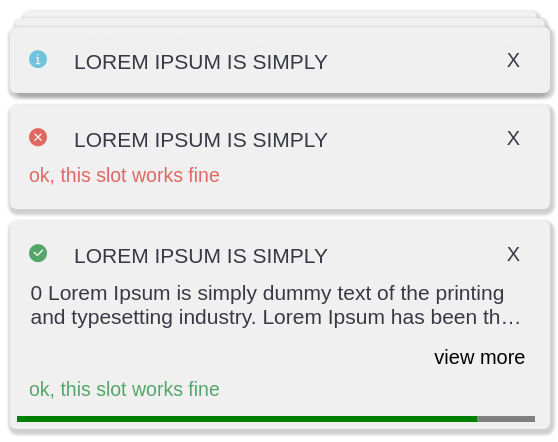
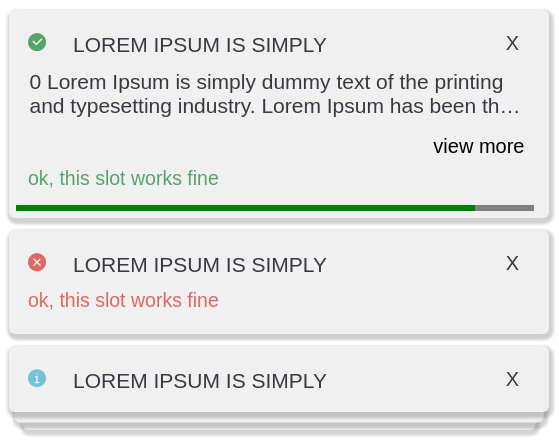
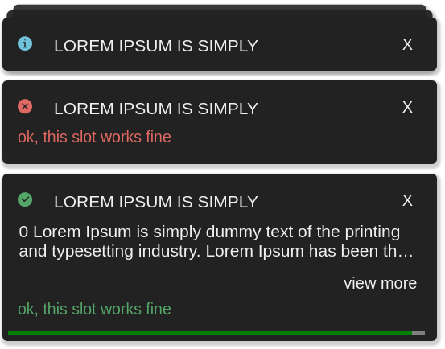
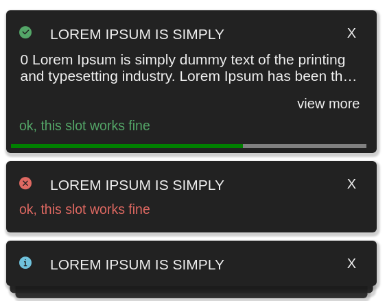

# Componentt-toast

This is a very simple and easy library for using toast in your application. 
 
> componentt-toast is created using [Stencil](https://stenciljs.com/) 

This library is inspired in a [codepen post](https://codepen.io/mtsgeneroso/pen/JVWqKe)


## Styles
componentt-toast have a two themes and two positions

Light - top


Light - bottom 



dark - top


dark - bottom 



# Usage

```js

<script type="module">
  import {Toast} from '/build/index.esm.js'

  const toast = new Toast({
    theme: 'light', // or dark
    placement: 'bottom' // or top
  })

  //create a element for put in action section   
  const button = document.createElement('button')
  button.innerHTML = 'ok, this slot works fine'
  button.addEventListener('click', () => console.log('I will clicked'))

  toast.emit({
    type: 'success', title: 'Lorem Ipsum is simply', progress: true, cooldown: 100000, description: `
    0 Lorem Ipsum is simply dummy text of the printing and typesetting industry. Lorem Ipsum has been the industry's
    standard dummy text ever since the 1500s, when an unknown printer took a galley of
    type and scrambled it to make a type specimen book.Lorem Ipsum is simply dummy text
    of the printing and typesetting industry. Lorem Ipsum has been the industry's standard dumm
    text ever since the 1500s, when an unknown printer took a galley of type and scrambled it to
    make a type specimen book.Lorem Ipsum is simply dummy text of the printing and typesetting industry.
    Lorem Ipsum has been the industry's standard dummy text ever since the 1500s, when an unknown printer
    took a galley of type and scrambled it to make a type specimen book.Lorem Ipsum is simply dummy text of
    the printing and typesetting industry. Lorem Ipsum has been the industry's standard dummy text ever since
    the 1500s, when an unknown printer took a galley of type and scrambled it to make a type specimen book.
  `, actions: [button]
  })
  toast.emit({
    type: 'error', title: 'Lorem Ipsum is simply', progress: false, cooldown: 100000, actions: [button]
  })
  toast.emit({
    type: 'info', title: 'Lorem Ipsum is simply', progress: false, cooldown: 100000
  })
  toast.emit({
    type: 'warning', title: 'Lorem Ipsum is simply', progress: false, cooldown: 100000, actions: [button]
  })
  toast.emit({
    type: 'warning', title: 'Title Prop', progress: false, cooldown: 100000
  })
</script>
```

# Creating a custom theme;
```css
[data-theme~='dark'] {
  .ctt-toast {
    &__item {
      background: #222222;
    }

    &__title,
    &__close > button,
    &__description,
    &__viewMoreOrLessButton button{
      color: #f0f0f0;
    }
  }

  ::-webkit-scrollbar-track {
    -webkit-box-shadow: inset 0 0 100px rgba(36, 37, 42, 0.9);
    border-radius: 5px;
  }

  ::-webkit-scrollbar-thumb {
    border-radius: 5px;
    -webkit-box-shadow: inset 0 0 100px rgba(136, 136, 143, 1);
  }
}
```
# Custom placement
```css
[data-placement~='top'] {
  top: 0;

  flex-direction: column-reverse;

  .ctt-toast {

    &__item:not(:last-child) {
      margin-top: 8px;
    }

    &__item:nth-child(n + 4) {
      top: 0;
      margin-top: 8px;
    }

    &__item:nth-child(n + 6) {
      opacity: 0;
    }

    &__item:nth-child(4) {
      opacity: 0.95;
      transform: translateY(-7px) scale(0.98);
      z-index: 1990;
    }

    &__item:nth-child(5) {
      opacity: 0.9;
      transform: translateY(-13px) scale(0.95);
      z-index: 1980;
    }

  }
}
```

# Icon

Yours custom icon 

```js
  toast.emit({
    type: 'error', title: 'Lorem Ipsum is simply', icon:"fa fa-alert", progress: false, cooldown: 100000, actions: [button]
  })
```
